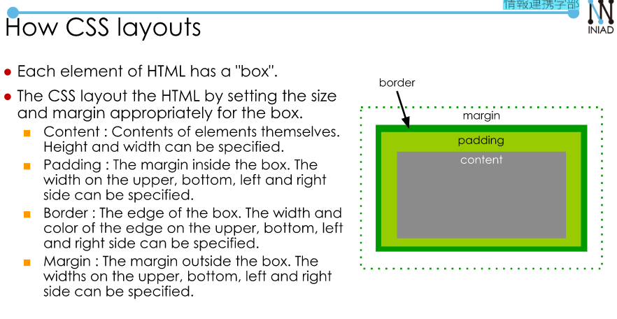

# HTML Training.  
My free style HTML training
## Note  
**How to apply CSS to HTML**  
- We need to add description in `head` element: `<link rel="stylesheet" type = "text/css" href = "URL of CSS file">`  
- Describe by ID:  
    + `Element#ID`
    + `#ID`  
- Describe by Class:  
    + `Element.class`  
    + `.class`      
- Descendant selector:  `A B` - Specify all B in the descendants of A  
- Child selector: `A > B` Specify B as the child of A.  


**How to apply Javascript**  
- `<script src="js/assignment.js"></script>`  
- `Display` in `div`  

Note: Represent by ID: `#id`, by class: `.class_name`.  

**Table tag**  
- `<table>`: init  
- `th`: table header
- `tr`: table row  
- `td`: table data  

**Margin, Padding, Border**  
    

**Different between setTimeout and setInterval**  
- `setTimeout` is designed to execute a function after a certain of time.
- `setInterval` is designed to execute a function **periodically** after a certain of time.  

How to use:  
- `setTimeout(function, time_in_milisecond)`, `setInterval(function, time_in_milisecond)` to start the count time.  
- `clearTimeout(ID)`, `clearInterval(intervalId)` to clear the running process.  
Example:  
```
var intervalId;
function startInterval() {
  cnt = 0;
  intervalId = setInterval(updateContentInterval, 1000);
}

function stopInterval() {
  clearInterval(intervalId);
```  
**Use form**  
```
  <form>
    <label for="infor">Do you want to know me more?</label>
    <select name = "contact">
      <option value = "Yes">Yes</option>
      <option value = "No">No</option>
    </select>
    <button onclick="info()">Submit</button>
  </form>
```  
- `name` to use to submit.    
- `value` to use for select buttom.  


  

